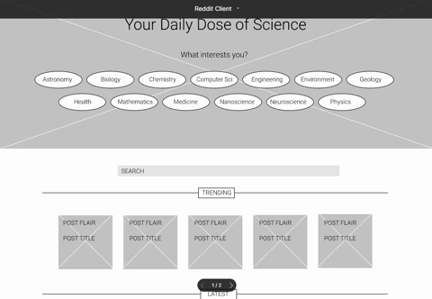
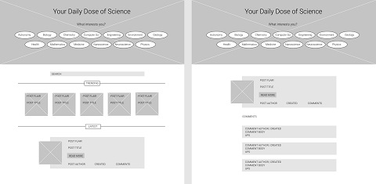
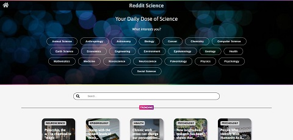
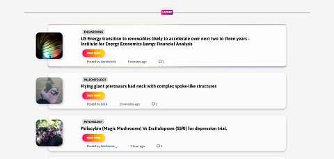
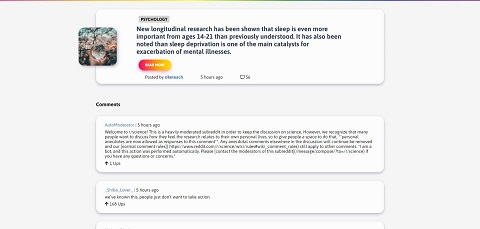

# Reddit Client

Reddit Client is one of Codecademy's open-ended portfolio projects on the Full-Stack Engineer career path. For this project, we were instructed to problem solve and utilize other resources, instead of being provided with step-by-step guidance. The requirements were to utilize React and Redux to build an application displaying Reddit data that would allow users to view and search posts and comments provided by the Reddit API.

The list of completed specifications for the application included:

- Build the application using React and Redux
- Version control the application with Git and host the repository on GitHub
- Use a project management tool (GitHub Projects, Trello, etc.) to plan our work
- Write a README (using Markdown) to document the project
- Write unit tests for our components using Jest and Enzyme
- Write end-to-end tests for the application
- Make the application responsive on all device types (desktop, tablet and mobile)
- Test the application's compatibility on all modern browsers
- Provide users access to the application at a URL
- Provide users an initial view of the app's data
- Provide the ability for users to search the data using terms
- Provide the ability for users to filter the data based on categories that are predefined
- Provide users with a detail view (modal or new page/route) when an item is selected
- Provide users with a cohesive design system, that includes animations and transitions
- Provide the ability for users to leave an error state
- Set up a CI/CD workflow to automatically deploy the application
- Get 90+ scores on Lighthouse

## Table of Contents

- [Features](#features)
- [Technologies](#technologies)
- [Wireframes](#wireframes)
- [Screenshots](#screenshots)
- [Future Work](#future_work)
- [Status](#status)

## Features

I chose to implement a Reddit Science application that displays both trending and latest posts discussing new scientific research shared in the science community. I utilized GitHub Projects to organize and plan the stages of development for the application. The data returned by Reddit can be filtered using both the science topic filters and/or by search terms. Each post displays the science category that it was posted under, the title, author, time of creation, numbers of comments and a "Read more" link to the original article source. Additionally, users can click on the title of a post to be routed to a more detailed view that includes the post's comments. The application has responsive layout changes for all device types and is continously deployed via Netlify at [reddit-science.netlify.app](https://reddit-science.netlify.app/).

## Technologies

This project was created with:

- JavaScript ES6
- Node.js version: 14.15.1
- Create React App version: 4.0.3
- React version: 17.0.2
- React Router version: 5.2.0
- React Redux version: 7.2.3
- Redux Toolkit version: 1.5.1

## Wireframes

The application's wireframes were created utilizing Figma.

## Screenshots

## Future Work

Make the application a progressive web app.

## Status

This project is in progress.